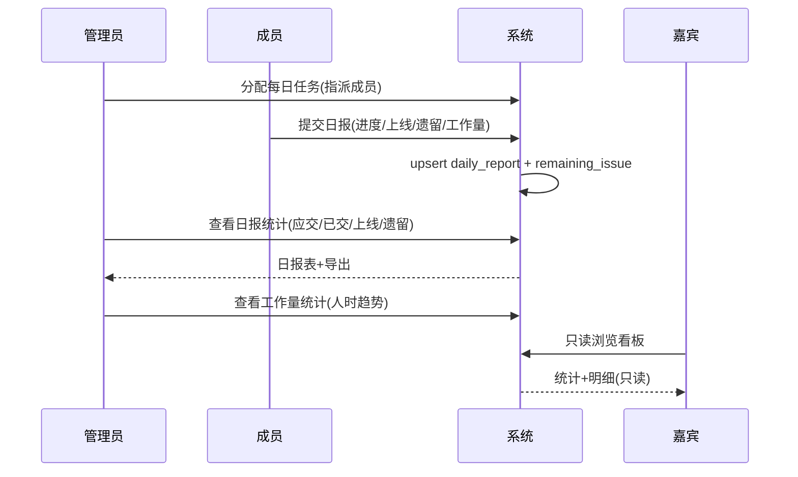

# 测试管理平台 · 设计文档 (DESIGN.md)

> 版本: v1.0 ｜ 日期: 2026-07-11 ｜ 状态: 已评审，可进入实现
>
> 一句话定位：面向测试团队的**多项目、日报驱动、可扩展**的测试管理平台——管理员分配每日任务，成员反馈测试进度/上线/遗留问题，沉淀日报与工作量统计，并通过适配器机制接入缺陷管理与自动化测试工具。

---

## 1. 目标与范围

### 1.1 核心目标
1. **权限配置**：管理员 / 成员 / 嘉宾 三种角色，多项目多团队。
2. **任务分配**：管理员按天给成员分配工作任务。
3. **日报反馈**：成员每日反馈所分配任务的测试进度、是否上线、遗留问题、工作量。
4. **统计**：日报统计（应交/已交/未交/上线/遗留）+ 工作量统计（人时趋势，供绩效复盘）。
5. **强扩展性**：代码级接入点，可对接缺陷管理（Jira/Tapd/禅道）与自动化测试结果（Jenkins/Pytest/接口平台）。

### 1.2 非目标（v1 不做）
- 不做测试用例库 / 测试执行引擎（这是专业测试工具的职责，本平台通过集成层对接它们，而非替代）。
- 不做 IM/邮件系统的完整实现（仅预留通知事件钩子）。

---

## 2. 技术选型

| 层 | 选型 | 理由 |
|---|---|---|
| 前端 | Vue3 + Vite + ElementPlus + Pinia + Vue Router + ECharts | 国内测试团队熟悉度高；表格/表单/图表场景多，EP+ECharts 适配好 |
| 后端 | **FastAPI (Python 3.11+)** + SQLAlchemy 2.0 + Alembic | Python 测试生态最厚(pytest/selenium)，集成适配器写起来快；自带 OpenAPI(`/docs`)，前后端联调省事 |
| 数据库 | MySQL 8 | 稳、招人易；统计多走 SQL 聚合 |
| 缓存/队列 | Redis（P3 起用于异步集成任务，MVP 可不装） | |
| 鉴权 | JWT (access + refresh) | |
| 部署 | Docker Compose（内网） | 单机起步，后续可迁 K8s |
| 导出 | openpyxl（Excel 导出） | 日报/工作量导出 |

> **后端替代方案**：若团队 Python 人手不足，可平替为 **NestJS + TypeORM**。下文数据模型与 API 设计语言无关，切换后端仅需替换 ORM 层。本设计默认 FastAPI。

---

## 3. 系统架构

```
┌─────────────────────────────────────────────────────┐
│  Vue3 前端 (ElementPlus + ECharts)                    │
│  登录 / 工作台 / 任务 / 日报 / 统计 / 遗留问题 / 集成配置 │
└──────────────────┬──────────────────────────────────┘
                   │ REST + JWT
┌──────────────────▼──────────────────────────────────┐
│  FastAPI 网关层 (路由 / JWT鉴权 / 权限拦截)             │
├─────────────────────────────────────────────────────┤
│  业务服务                                              │
│  用户·项目·权限 │ 任务 │ 日报 │ 遗留问题 │ 统计         │
├─────────────────────────────────────────────────────┤
│  集成层 (扩展核心)                                     │
│  适配器注册表 │ Webhook 入口 │ 事件总线 │ API Token      │
│  └ Jira/Tapd/禅道 │ Jenkins/GitLabCI │ Pytest/接口平台  │
├─────────────────────────────────────────────────────┤
│  MySQL 8  │  Redis(异步任务, P3起)                     │
└─────────────────────────────────────────────────────┘
```

**分层职责**
- 网关层：统一鉴权、请求日志、CORS、统一异常响应。
- 业务服务：按领域划分模块，互不直接依赖，跨域通过事件总线。
- 集成层：所有对外工具接入的唯一出入口，业务层不直接调外部工具。

---

## 4. 权限模型（RBAC + 多项目矩阵）

### 4.1 角色定义

| 角色 | 作用域 | 能力 |
|---|---|---|
| 平台管理员 | 全局（`user.is_platform_admin=1`） | 建项目、建团队、管所有人员、配全局集成 |
| 项目管理员 `admin` | 单项目 | 给本项目分配每日任务、看本项目全部统计、管本项目成员 |
| 成员 `member` | 单项目 | 接收任务、提交日报、看自己 + 项目公开统计 |
| 嘉宾 `guest` | 单项目 | **纯只读**浏览（任务/日报/统计/遗留问题），无任何写权限 |

### 4.2 授权关系

- 用户 ↔ 项目 = 多对多，关系带角色：`project_member(user_id, project_id, role, team_id)`。
- 一个人可在 A 项目是 admin、B 项目是 member。
- 平台管理员标志位 `user.is_platform_admin` 跨项目生效。

### 4.3 鉴权实现
- 登录发 JWT（access 2h + refresh 7d）。
- 后端依赖注入：`require_project_role("admin"|"member"|"guest")` 同时校验项目成员关系与角色。
- 数据级隔离：所有查询带 `project_id` 过滤；guest 路由只挂 GET。
- 前端：按角色 + 项目成员关系渲染菜单/按钮，但**后端是唯一真相源**。

---

## 5. 数据模型（MySQL）

> 命名：表名蛇形单数，主键 `id BIGINT AUTO_INCREMENT`，统一 `created_at` / `updated_at`。下文省略公共字段。

```sql
-- ========== 用户与组织 ==========
user (
  id, username UNIQUE, password_hash, name, email,
  is_platform_admin TINYINT DEFAULT 0,
  status ENUM('active','disabled'),
  created_at, updated_at
)

project (
  id, name, code UNIQUE, description, status ENUM('active','archived'),
  created_at, updated_at
)

team (
  id, project_id FK, name, created_at
)

-- 项目成员（授权核心）
project_member (
  user_id FK, project_id FK, team_id FK NULL,
  role ENUM('admin','member','guest'),
  created_at,
  PRIMARY KEY (user_id, project_id)
)

-- ========== 任务分配 ==========
task (
  id, project_id FK, team_id FK NULL,
  assigned_by FK(user), assigned_to FK(user),
  title, description TEXT,
  module VARCHAR,               -- 被测项目/模块
  priority ENUM('p0','p1','p2','p3'),
  assigned_date DATE,           -- 按天分配
  status ENUM('pending','doing','done','closed'),
  created_at, updated_at,
  INDEX idx_project_date (project_id, assigned_date),
  INDEX idx_assignee (assigned_to, assigned_date)
)

-- ========== 日报反馈 ==========
-- 一个 task 在一个 report_date 下只有一条 daily_report
daily_report (
  id, task_id FK, user_id FK, project_id FK,
  report_date DATE,
  progress_pct TINYINT,         -- 0-100 测试进度
  is_online TINYINT,            -- 是否上线
  online_time DATETIME NULL,
  workload_hours DECIMAL(5,1),  -- 工作量(人时)，供工作量统计
  summary TEXT,                 -- 今日小结
  created_at, updated_at,
  UNIQUE KEY uk_task_date (task_id, report_date),
  INDEX idx_project_date (project_id, report_date)
)

-- 遗留问题（从日报结构化拆出，便于跟踪与统计）
remaining_issue (
  id, report_id FK, project_id FK,
  title, description TEXT,
  severity ENUM('blocker','major','minor'),
  status ENUM('open','resolved'),
  owner FK(user) NULL,
  external_ref VARCHAR,         -- 关联 Jira/Tapd 缺陷ID
  created_at, resolved_at NULL,
  INDEX idx_project_status (project_id, status)
)

-- ========== 集成层 ==========
integration (
  id, project_id FK NULL,       -- NULL=全局集成
  type VARCHAR,                 -- jira/tapd/zentao/jenkins/pytest/...
  config_json JSON,             -- 非敏感配置
  credential_ref VARCHAR,       -- 指向密钥存储的引用，不明文存
  enabled TINYINT,
  created_at, updated_at
)

api_token (
  id, user_id FK, name,
  token_hash VARCHAR,           -- 仅存哈希
  scopes JSON,                  -- 如 ["reports:write","results:push"]
  expires_at DATETIME,
  created_at
)

-- Webhook/外部推送落库（审计 + 重放）
integration_event (
  id, integration_id FK NULL,
  source VARCHAR,               -- jira/jenkins/...
  payload_json JSON,
  received_at DATETIME,
  status ENUM('received','processed','failed'),
  error TEXT NULL
)
```

> **设计取舍**：工作量统计由 `SUM(daily_report.workload_hours)` 聚合得出，**不单独建统计表**，避免双写不一致；数据量大后再加物化视图/日聚合表。

---

## 6. 核心业务流程

### 6.1 管理员分配任务
工作台 → 选项目 + 日期 → 新建任务（指派成员、模块、优先级、说明）→ 支持「复制昨日任务」批量建。任务状态默认 `pending`。

### 6.2 成员提交日报
「我的任务」→ 对每条当日任务填写：进度% / 是否上线（含上线时间）/ 工作量(人时) / 今日小结 / 遗留问题（可多条，结构化：标题+严重度+负责人+外部缺陷ID）。
提交 → upsert `daily_report` + 同步 `remaining_issue`。

### 6.3 日报统计
按 **项目 × 日期** 汇总：
- 应交人数（当日被分配任务的成员数）
- 已交 / 未交名单
- 平均进度、当日上线数
- 新增遗留问题数、未解决遗留问题数
- 支持 Excel 导出

### 6.4 工作量统计
按 **成员 × 时间区间（周/月）** 聚合 `workload_hours` + 任务数 + 上线数，ECharts 柱状/趋势图；支持按项目、团队筛选。供绩效与排期复盘。

### 6.5 嘉宾浏览
登录后只读看板：项目统计总览 + 日报明细 + 遗留问题列表。前端隐藏所有写按钮，后端拒绝所有写请求。

### 流程图


---

## 7. 扩展性设计（接测试工具的核心）

平台"强扩展性"由三个互相解耦的抽象保证。MVP 只搭骨架，不实现具体适配器。

### 7.1 适配器接口（Adapter）
每种工具实现统一接口；新增工具 = 新增一个文件并注册，**零侵入业务代码**。

```python
# backend/app/integrations/base.py
class IntegrationAdapter:
    name: str                       # "jira" / "tapd" / "jenkins" ...

    def fetch_defects(self, project_id: int, since: datetime) -> list[DefectDTO]:
        """从外部系统拉取缺陷，回填到 remaining_issue.external_ref"""
        ...

    def push_result(self, project_id: int, result: TestResultDTO) -> str:
        """把测试结果推送到外部系统（或反向：接收外部结果入库）"""
        ...

    def sync_status(self, issue_id: int) -> str:
        """同步遗留问题状态（如 Jira 关闭 → 本地 resolved）"""
        ...

# 注册表
class AdapterRegistry:
    _map: dict[str, type[IntegrationAdapter]] = {}
    @classmethod
    def register(cls, name): ...
    @classmethod
    def get(cls, name) -> IntegrationAdapter: ...

# 例如
AdapterRegistry.register("jira", JiraAdapter)
AdapterRegistry.register("tapd", TapdAdapter)
```

### 7.2 统一 Webhook 入口
外部系统（Jenkins 构建完成、Pytest 跑完、Jira 缺陷变更）统一往一个入口推：

```
POST /api/integrations/webhook/{source}
Header: X-Platform-Token: <api_token>
Body:  任意 JSON
```
处理：落 `integration_event`（审计+可重放）→ 按 `source` 找适配器解析 → 产生领域事件或直接入库。

### 7.3 API Token + 事件总线
- **API Token**：外部脚本/CI 可凭 token 主动推数据（如 `POST /api/results` 推一条自动化测试结果）。
- **事件总线**：平台内事件（`daily_report.submitted`、`issue.created`、`issue.resolved`）发布到总线，已注册的适配器订阅 → 自动同步到外部系统（如新遗留问题自动建 Jira 缺陷）。

```python
# 事件总线伪代码
@on("issue.created")
def sync_issue_to_jira(issue):
    adapter = AdapterRegistry.get("jira")
    external_id = adapter.push_result(project_id, issue)
    issue.external_ref = external_id  # 回填
```

### 7.4 接入新工具的标准步骤
1. 在 `integrations/adapters/` 新增 `xxx_adapter.py` 实现 `IntegrationAdapter`。
2. 在注册表登记。
3. 若需被动接收 → 复用 webhook 入口；若需主动拉取 → 起一个定时任务调 `fetch_defects`。
4. 在前端「集成配置」页填入 `integration` 记录（含凭证引用）。

---

## 8. API 设计（RESTful，节选）

> FastAPI 自动生成 `/docs` Swagger，前端直接对着联调。所有写接口需对应角色。

```
# 鉴权
POST   /api/auth/login                 -> {access, refresh}
POST   /api/auth/refresh

# 项目与成员
GET    /api/projects
POST   /api/projects                   [平台管理员]
GET    /api/projects/{pid}/members
POST   /api/projects/{pid}/members     [admin]   # 加人/设角色
PATCH  /api/projects/{pid}/members/{uid}          # 改角色

# 任务
POST   /api/tasks                      [admin]   # 分配
GET    /api/tasks?project=&date=&mine=1
PATCH  /api/tasks/{id}                 [admin]

# 日报
POST   /api/daily-reports              [member]  # upsert(同task同date)
GET    /api/daily-reports?project=&date=

# 遗留问题
GET    /api/issues?project=&status=open
PATCH  /api/issues/{id}                [admin/member:owner]

# 统计
GET    /api/stats/daily?project=&date=            # 日报统计
GET    /api/stats/workload?from=&to=&group_by=member&project=
GET    /api/stats/overview?project=               # 看板概览

# 集成层
POST   /api/integrations               [admin]   # 配置集成
GET    /api/integrations
POST   /api/integrations/webhook/{source}         # 外部推送
POST   /api/results                               # API Token 推测试结果
```

### 统一响应格式
```json
{ "code": 0, "msg": "ok", "data": { ... } }
```
错误：`code != 0`，HTTP 状态码语义化（401/403/422/500）。

---

## 9. 前端页面清单

| 页面 | 主要角色 | 说明 |
|---|---|---|
| 登录 | - | 用户名密码 |
| 全局工作台 | 全部 | 项目切换器 + 角色相关卡片入口 |
| 任务管理 | admin | 按日期分配/编辑任务，复制昨日 |
| 我的任务 + 日报填报 | member | 当日任务列表 + 日报表单 |
| 日报统计 | admin/member | 项目×日期汇总表，未交名单，导出 |
| 工作量统计 | admin | 成员×周/月人时趋势图(ECharts) |
| 遗留问题跟踪 | admin/member | 列表+筛选+状态流转 |
| 项目/成员管理 | admin/平台管理员 | 成员、角色、团队 |
| 集成配置 | admin/平台管理员 | 新增/启停集成、填凭证、API Token 管理 |
| 嘉宾只读看板 | guest | 统计总览+明细，无写按钮 |

---

## 10. 统计方案细节

### 10.1 日报统计 SQL（示意）
```sql
SELECT
  COUNT(DISTINCT t.assigned_to) AS should_submit,
  COUNT(DISTINCT dr.user_id)    AS submitted,
  ROUND(AVG(dr.progress_pct),1) AS avg_progress,
  SUM(dr.is_online)             AS online_cnt,
  SUM(CASE WHEN ri.status='open' THEN 1 ELSE 0 END) AS open_issues
FROM task t
LEFT JOIN daily_report dr
  ON dr.task_id = t.id AND dr.report_date = :date
LEFT JOIN remaining_issue ri ON ri.project_id = t.project_id
WHERE t.project_id = :pid AND t.assigned_date = :date;
```
未交名单 = should_submit 集合 − submitted 集合。

### 10.2 工作量统计
```sql
SELECT user_id,
       DATE_FORMAT(report_date,'%Y-%u') AS week,
       SUM(workload_hours) AS hours,
       COUNT(DISTINCT task_id) AS task_cnt,
       SUM(is_online) AS online_cnt
FROM daily_report
WHERE project_id = :pid AND report_date BETWEEN :from AND :to
GROUP BY user_id, week;
```
前端 ECharts 渲染堆叠柱状/折线。

---

## 11. 安全

- 密码：bcrypt。
- JWT：access 短 + refresh 长；登出拉黑 refresh（Redis，P3 起；MVP 可仅前端丢弃）。
- 凭证：外部系统密钥不明文入库，存引用 + 环境变量/密钥服务。
- API Token：仅存 hash，支持 scope 与过期。
- 越权防护：后端按 `project_member` 强制过滤 project_id；guest 路由只读。
- 审计：集成层所有外部交互落 `integration_event`。
- 内网部署仍走 HTTPS（自签或内网 CA），防内网嗅探。

---

## 12. 部署

```yaml
# docker-compose.yml 概要
services:
  mysql:    image: mysql:8  (持久化卷)
  redis:    image: redis:7  (P3起)
  backend:  build: ./backend  (uvicorn, 暴露 8000)
  frontend: build: ./frontend (nginx 静态 + 反代 /api -> backend, 暴露 80)
```
- 配置走环境变量（`.env`）。
- 数据库迁移用 Alembic（`alembic upgrade head`）。
- 内网访问 `http://<内网IP>`，建议前置 HTTPS。

---

## 13. 落地路线（约 5 周）

| 阶段 | 内容 | 验证标准 |
|---|---|---|
| **P0 脚手架** (~3天) | 前后端工程、DB、Alembic、JWT 登录、RBAC、项目成员模型 | 不同角色登录看到不同菜单；越权请求被拒 |
| **P1 MVP** (~2周) | 任务分配 + 日报反馈 + 日报统计 + Excel 导出 | admin 发任务→member 填日报→出日报表并导出 |
| **P2 统计增强** (~1周) | 工作量统计图表 + 遗留问题跟踪 + 嘉宾只读看板 | 出人时趋势图；遗留问题可流转闭环；guest 无写按钮 |
| **P3 集成层** (~1-2周) | 适配器接口 + webhook 入口 + 事件总线骨架 + 首个适配器(待定 Jira/Tapd/禅道) | 外部推 webhook 能落库；遗留问题能同步到缺陷系统 |
| **P4 扩展** | 更多适配器、钉钉/飞书通知、自动化结果入库看板 | |

---

## 14. 目录结构

```
test-platform/
├── backend/
│   ├── app/
│   │   ├── main.py
│   │   ├── core/              # config, security(JWT), deps(权限依赖)
│   │   ├── models/            # SQLAlchemy: user, project, task, report, issue, integration
│   │   ├── schemas/           # Pydantic 入参/出参
│   │   ├── api/               # 路由: auth, projects, tasks, reports, stats, issues, integrations
│   │   ├── integrations/      # 扩展核心
│   │   │   ├── base.py        # IntegrationAdapter + Registry
│   │   │   ├── events.py      # 事件总线
│   │   │   └── adapters/      # jira.py, tapd.py, jenkins.py ...
│   │   └── services/          # 业务逻辑
│   ├── alembic/               # 迁移
│   ├── tests/
│   └── pyproject.toml
├── frontend/
│   ├── src/
│   │   ├── views/             # 按页面
│   │   ├── api/               # axios 封装
│   │   ├── store/  src/router/  src/components/
│   └── vite.config.ts
└── docker-compose.yml
```

---

## 15. 待确认事项

1. **后端**：默认 FastAPI；若团队偏 JS，切 NestJS（模型与 API 不变）。
2. **P3 首个对接系统**：Jira / Tapd / 禅道，三选一，决定首个适配器写哪个。
3. **首批项目与成员**：P0 验收需要一个真实项目 + 几位成员数据。

确认后即可进入 P0 脚手架实现。
