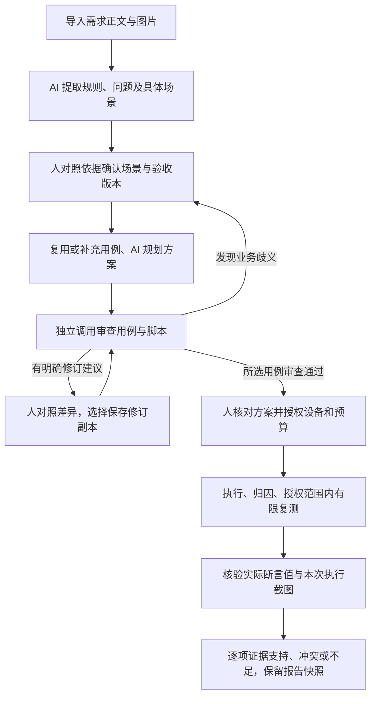

# AI Native 第二轮：场景、用例审查与证据核验

本轮以功能测试目标为入口，补上三个质量检查环节。AI 自主准备、审查和跟进；人确认业务意图、选择修订与授权执行。场景是需求草案的状态演示，不能替代实际产品执行。

## 调整后的主流程

### 1. 产品先确认具体场景

「需求澄清与验收确认」默认展示场景卡：谁、起始状态、操作、可观察结果、不能出现的结果，以及关联验收编号。支持逐步查看状态变化、修改场景、对照原文或原图，相关澄清问题及产品决定在卡片内显示。

新分析要求已确认验收条件都有完整且人工核对过的场景。AI 不能设置“已核对”、回答产品问题或确认规则。用户修改场景、规则、范围或澄清结论后，相关场景核对会失效；先保存修改，再重新核对。缺角色、缺预期、缺关联场景都会阻止确认。原文未说明的反例保持空白，不自动补造。

真实摘录评测后进一步收紧理解规则：没有定义的行为保留待澄清，不自动列为本期非目标；不从处理发生位置补造结果展示限制；没有依据时不选择总则／细则优先级。摘要、流程及规则字段也需遵守这些约束。提示词仍可能被模型违反，人对照来源核对的步骤保留。

旧分析和不可变验收版本仍可查看。使用没有场景复核机制的旧分析创建新测试目标时，会基于原材料创建新的分析，补充场景后重新确认；旧版本与旧报告不改写。

### 2. 独立审查决定哪些用例可下发

AI 规划选出候选后，另一次模型调用只查看已确认约束、场景、产品决定及用例／脚本，不接收规划者的自评。逐个检查关联验收条件、遗漏分支、无依据预期、可观察断言、前置资料和业务歧义。每次最多审查 10 个用例，所有选中用例都必须返回，未知或缺失编号会使任务失败。

审查问题在方案内展示。存在问题的用例不能下发，其他已通过的用例可以选择执行；未执行的范围继续保留为缺口。独立审查仍使用平台所选引擎，通过分开上下文减少生成者自评的影响，不保证模型间错误独立，也不替代人的业务确认。

明确规则已有答案时可给出文本修订建议。人展开当前／建议差异，点击“应用此修订草稿”后保存为待采纳副本，保留原用例、已有采纳和历史执行。旧用例从本目标候选中排除，修订副本重新规划、独立审查、人工核对后才可执行。本轮每个用例及其副本最多应用一次 AI 修订，进一步修订在用例库人工处理。不会自动改脚本或产品验收版本；脚本与新文本的对应关系也需重新审查。业务歧义不给自动修订建议，应先修订需求并确认新版本。

旧的待授权方案必须重新准备，补充独立审查后才能执行。

### 3. 最终结论检查证据内容

执行结束后自动进入“核验证据”。逐条对照验收条件，读取报告中的实际断言值，以及服务器已经保存的本次执行截图。步骤说明、总体通过标记和外部证据链接不能单独证明业务结果。

- GUI 执行机补充通过时的文本、可见／不可见断言实际结果及定位对象。
- API 执行机补充各字段的实际断言值、操作符和目标字段；不复制鉴权头，常见凭据字段、复杂响应和过长值保留为不可用。敏感值需要专门准备可安全核验的证据。
- 服务端重新计算支持的断言比较，核验模型引用的步骤与实际值是否存在；模型不能用“通过建议”覆盖引用步骤的断言冲突。
- 图片只读取当前执行目录内的 PNG，拒绝跨执行目录、符号链接和外部 URL。每次最多 8 张、每张不超过 10 MB，按最长边 2048 像素提供给模型；结果标明实际读取数量。未读取或看不清的内容不能支持通过。不支持图片的所选引擎不会静默切换到另一服务。
- 图片判断标明步骤、可见区域及观察结果。文字与图片的业务含义由 AI 核对，仍可能误判，需使用样本及人工复核持续校准。
- 无实际观察值且无可读图片时直接判“证据不足”，不额外调用模型。格式错误、伪造引用、模型失败也不能变成有效通过。

页面展示“证据支持／证据冲突／证据不足／核验中”，可进入原步骤查看实际值和截图。最终分母仍是全部已确认验收条件，失败、未执行、过期、未采纳、重试后通过等既有限制继续生效。

核验结果绑定验收版本、用例快照、执行报告及截图内容指纹。报告或截图变化／过期会使当前核验失效。已收口目标可点击“重新核验证据”，为新证据或此前失败的核验补充判断；相同且已完成的核验不重复调用模型。不会重新执行用例，也不改写当时的收口报告快照。

## 上线与兼容

新增 `test_mission_assessment` 表，沿现有启动建表流程创建；文档字段兼容 MySQL 5.6 LONGTEXT，不给旧表增加列。核验任务与结果指针同事务保存，按执行内容指纹去重，任务中断可恢复或显式重试。核验期间证据变化会拒绝保存旧判断。

需同步更新前后端并重启服务；执行机需更新 `step-executor.mjs`、`api-executor.mjs` 才能回传新增的通过断言数据。旧执行机仍可执行，但没有足够实际证据的记录会显示证据不足。原有 AI 测试助手保留独立使用方式；其场景确认同步升级，独立用例审查与证据核验由“测试目标”闭环提供。对话测评和性能测试尚未统一进入目标调度。

Claude 调用增加 skills 与非托管 hooks 隔离，保留当前鉴权与模型配置。服务机器的 CLI 需支持 `--disable-slash-commands` 与 `--settings`；托管 hooks 仍服从组织策略。本机真实合成调用已验证参数可用，尚未验证服务器 CLI 版本。

## 小规模评测集

[样本与运行说明](../backend/evals/ai-native/README.md)随代码提供 8 个完全合成样本，覆盖需求场景、用例偏离、实际证据冲突、无观察值、对象不明、提示词干扰。另有 9 个真实需求摘录候选样本保留本地，不随公开仓库分发；尚无产品确认标签。

评测命令默认只校验数据；显式运行时默认排除待校准摘录。报告分开合成、待校准和人工确认结果，保存数据／提示词哈希、每项输出、耗时、已有费用信息；模型和样本版本变化可以复核比较。需求理解自动指标只检查结构，业务理解仍需按样本 rubric 人工校准。

格式失败排查后，工具增加本地提示词及原始响应保存（最多 200,000 字符并标记截断）；早期未保存的原始响应不会回填。

## 本轮验证记录

- 34 项隔离数据库的后端集成／专项测试通过；覆盖场景确认失效、旧版本升级、审查遗漏与伪造编号、修订副本与限次、实际值冲突、截图越界／过期、证据变化期间拒绝旧判断、重试及权限。
- GUI／API 执行机 33 项测试通过；AI 队列、调度、项目问答既有检查通过。
- 3 组模拟 API 浏览器回归通过：需求与原图／场景确认、目标授权与恢复、独立审查修订及证据详情；桌面与窄屏已检查，前端构建通过。
- [完整合成评测报告](../backend/evals/ai-native/reports/2026-09-13-synthetic.json)：8 项中 7 项符合预期，1 项需求理解调用达到 180 秒超时；其中无观察值样本由程序直接判不足，其余 7 项调用配置的 Claude 引擎。超时项按失败记录，不能算通过。该需求理解样本在此前校准试验中曾成功，当前结果反映调用稳定性仍需观察。
- 真实模型试验发现并修正了正例缺少对象标识、审查提示词未枚举全部合法分类两处问题。既有样本／输出记录保留，未通过修改校验器放行无依据结论。
- 这批结果记录了引擎与提示词／数据哈希，初次试验未记录实际模型版本；后续工具会额外保存模型配置，严格比较需固定模型。有限合成样本不能证明真实需求理解准确率，也没有对用户实际执行机做端到端操作。
- 获用户明确授权后，9 个真实需求摘录完成首轮调用：3 项匹配临时标签、3 项不符、3 项调用或格式失败；私有输入、原始响应与对照报告保留本地，未公开提交。试点发现未知范围被排除、无依据推断、缺核验步骤及模型输出稳定性问题。标签仍未由产品确认，不能据此给出业务准确率。

## 生成过程可见（2026-09-14）

需求分析和用例生成期间展示真实阶段、已处理图片/批次数、已返回字数与等待时间。图片识别逐张返回；需求理解、验收规则和用例正文随模型输出持续更新，可切换查看各项。上滑阅读时不会被强制拉回底部，点击“查看最新内容”可继续跟随。没有正文时明确显示等待；长时间无新正文时保留已有内容并显示等待后续返回。

现有流程调整为：导入需求 → 实时查看图片识别 → 实时查看需求与验收草稿 → 完整结果校验 → 人工澄清和确认 → 实时查看用例批次 → 合并、校验、保存 → 用例评审。预览内容不会创建确认版本、解锁用例生成或提前成为正式用例。

分析中“停止等待”保留页面上的输出，后台继续执行；“继续查看分析进度”以及恢复未完成的历史分析都会重新接上进度。任务失败时保留已接收的正文供核对。超长内容的预览窗口有上限，并明确提示截取；完整识别结果、验收草稿和用例仍走原有的最终结果存储。

实现沿用持久化 AI 任务队列：模型逐段输出，后台通常每秒最多保存一次正文快照（首段、阶段变化与结束时立即保存），页面每两秒读取一次。Claude 开启 partial messages 并去除重复的完整消息；DeepSeek 继续使用正文 delta。预览不包含思维链、图片二进制或工具调用。进度沿用任务/项目权限，暂存于现有 AiJob.result 字段，终态成功时由正式结果替换，无数据库结构迁移。进度保存失败不影响生成；恢复后续快照可继续更新。

此调整改善等待过程的可见性，不承诺缩短模型计算时间，也不会把未完成的输出视为产品已确认的预期。

## 长时间分析失败的恢复（2026-09-14）

原实现把规则与最多 500 个场景放进一次 JSON 生成，随后仅用整段 `json.loads` 解析。围栏外说明、尾随逗号、输出截断都会导致整个分析没有可评审草稿；报错把它们统一称为“格式错误”，旧需求分析任务也没有保存完整原始返回。确认版本本来就应在人确认后创建，因此新的提示区分“尚未完成草稿”和“尚未人工确认”。

现在的流程是：复用或识别图片 → 保存完整需求规则 → 每批 6 个验收条件生成具体场景 → 检查场景关联及条件覆盖 → 保存完整评审草稿 → 人工确认版本。批次失败不会删除其他批次；“继续处理失败部分”重新入队同一分析，按不可变输入、引擎和输出结构的指纹复用已验证结果。图片每完成一张即保存；旧历史分析中已有的成功/部分不确定图片识别也可复用。规则不因分批而从原文中隔离，需求理解阶段仍联合读取正文、全部图片识别与历史上下文，以保留跨章节冲突。

完整模型正文和验证通过的阶段存入新增的 `requirement_analysis_part` 表，正文使用 MySQL LONGTEXT。服务启动的 `create_all` 会创建该表；无须改动已有表。失败时保存错误类型和原始正文，详情只返回摘要，完整输出通过项目权限保护的独立接口读取。旧任务未保存的原始响应无法补回，但已保存的图片识别不会因此重跑。

模型输出优先使用结构约束。Claude 使用 `--json-schema`，正确读取最终 `structured_output`；DeepSeek 使用 JSON 模式，同时保留流式正文。旧网关明确报告不支持格式参数时，仅回退一次到提示词约束和同样严格的本地验证。具体场景的结构中列出本批允许的规则和条件编号，避免模型照抄示例编号。仅能唯一对应到既有编号的大小写、横线/下划线差异可本地统一，不改写规则或验收内容。

解析兼容单个完整对象外的围栏/说明文字、BOM、额外字符串包装、尾随逗号及字符串内原始换行，保持字段值和条目不变。重复键、多份不同对象、缺少结束标记、长度截断、编号歧义或场景漏项都不能直接成为完整草稿。格式/结构异常最多自动重试当前阶段一次；再次失败保留原始返回及其他成功结果。已收到完整响应但在解析/保存过程中中断的阶段可从保存内容本地恢复。重试不会替用户确认规则，也不会解锁不完整结果的用例生成。

各场景批次在生成前共同分配最终 500 条场景的容量，每个验收条件至少预留一个场景的位置，避免各批次独立合格但合并后超限。服务端同样验证批次容量与条件覆盖，不靠丢弃场景或条件通过最终校验。

协议依据：[Claude Agent SDK 结构化输出](https://code.claude.com/docs/en/agent-sdk/structured-outputs)、[DeepSeek JSON 模式](https://api-docs.deepseek.com/guides/json_mode/)。协议约束改善可解析性；最终仍需要字段、引用、覆盖检查和人工业务确认，不能据此承诺模型输出的业务理解永远正确。

本轮使用完全合成的新增/取消表单需求验证当前 Claude 服务。真实返回暴露出 `R1C1` 被改写为 `R1-C1` 的关联错误；增加本批编号枚举约束与唯一格式匹配后，仅重新处理失败批次，复用已完成结果，得到 5 条规则、9 个条件、9 个场景，条件关联全部覆盖，规则与场景均保持待人工确认。该检查证明本次协议与恢复路径能够工作，不等同于真实需求的业务验收。

本轮 69 项后端检查、3 组浏览器流程回归与前端构建通过，含 100/499/500 条条件的场景合并边界、恢复输出权限、重复重试、旧任务写入保护、人工确认门槛以及桌面/窄屏恢复界面。浏览器使用模拟接口，真实模型验证仅使用合成需求；尚未针对截图中的生产任务重跑。

## 场景阶段的耗时修正（2026-09-14）

上面的首次恢复方案存在性能回退：每 6 个条件一次模型调用，最多 3 个并发，108 个条件会增加 18 次场景调用、至少 6 轮调度；所有批次提前提交，前序超时后仍继续消耗后续调用；单批又写死 180 秒，覆盖了平台原有的模型超时配置。这些因素会把需求确认前的等待放大。

本次改为每批最多 24 个条件，并按上下文长度调整。保留当前批次完整规则、条件、来源摘录、总体范围和流程，以及全局问题和关联问题；不重复发送其他模块的问题和审核元数据。长公共上下文本身不会把任务拆成逐条件调用，不通过截断正文或丢条件缩小请求。每个原子验收条件对应一个待核对场景，具体测试用例仍在确认后生成；此阶段不额外扩写一轮正常/边界/异常变体。

Claude 的场景整理采用正文 JSON 流式输出，结构约束仍放在提示词中，由平台检查全部条件、重复/非法编号及字段类型。规则分析保留原生结构化输出，DeepSeek 的场景整理保留原生 JSON 模式。场景编号、所属规则和未审核状态由平台填写。单批使用平台配置的模型截止时间，不再强行使用 180 秒。

仅 Claude 场景整理默认使用 `AI_REQUIREMENT_SCENE_EFFORT=low`，通过该次子进程的 `CLAUDE_CODE_EFFORT_LEVEL` 传递；不更换模型、不改用户配置文件、不影响全局环境或其他阶段。可设空字符串继承 CLI 配置，或提高到 medium/high。参数依据：[Claude Code 推理强度配置](https://code.claude.com/docs/en/model-config)。完整需求理解、冲突分析和最终用例生成继续沿用原有推理设置。

调度仅派发正在执行的槽位，受平台和引擎并发上限约束。发现失败后停止派发后续批次，保留当前活动批次的成功结果；页面区分“失败”和“尚未开始”，默认展示已收到的失败正文。空响应/无流式事件标为模型网关异常，不当作 JSON 语法错误自动重跑。重试时兼容已发布六条件批次的输入指纹，成功图片、规则和场景可继续复用，规则或上下文变化则拒绝复用旧语义。

108 条合成条件的完整流程验证：场景调用从 18 次降到 5 次，规则理解另 1 次；同输入恢复不再调用模型。该样本场景提示词正文总量从 19,926 字符降至 10,864 字符，减少 45.5%，不代表所有需求耗时同比下降。真实 Claude 对照中，原生结构化调用约 122 秒后遇到网关 HTTP 200 无有效响应；普通 JSON 调用成功返回 24 个场景，耗时 179.8 秒，首段等待 163.1 秒。测试仅使用合成材料，不能据此认定生产网关已恢复或业务理解已通过人工验收。

同一模型和同一组 24 个合成条件的低推理强度对照，耗时 63.6 秒、首段等待 48.4 秒；全部条件编号与“删除前展示确认、取消后保留”的预期保留。未知角色仍为空、场景仍须人工核对。两次对照未经多轮随机重复，服务排队等因素也可能影响耗时，不能据此承诺真实需求的固定提速比例。

本轮 78 项后端检查、需求分析与恢复页面回归、前端构建通过，覆盖 108 条条件调用数与恢复不重跑、旧版缓存兼容、长公共上下文避免过度分批、失败停止派发与保留活动结果、网关异常分类，以及推理设置对子进程的隔离。服务端 Claude CLI 需支持上述推理强度环境变量才能获得对应收益；未修改生产模型配置，也未重新发送用户的实际需求。
