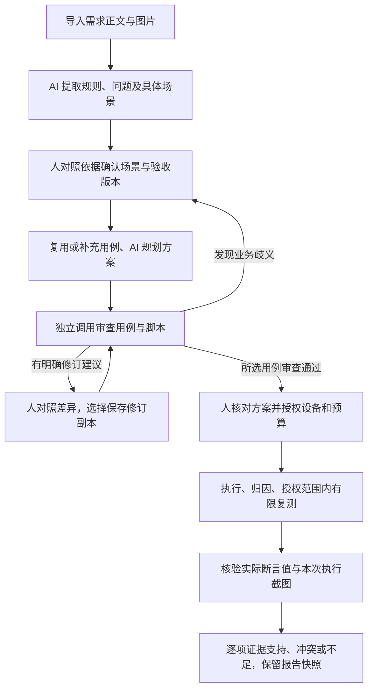

# AI Native 第二轮：场景、用例审查与证据核验

本轮以功能测试目标为入口，补上三个质量检查环节。AI 自主准备、审查和跟进；人确认业务意图、选择修订与授权执行。场景是需求草案的状态演示，不能替代实际产品执行。

## 调整后的主流程

### 1. 产品先确认具体场景

「需求澄清与验收确认」默认展示场景卡：谁、起始状态、操作、可观察结果、不能出现的结果，以及关联验收编号。支持逐步查看状态变化、修改场景、对照原文或原图，相关澄清问题及产品决定在卡片内显示。

新分析要求已确认验收条件都有完整且人工核对过的场景。AI 不能设置“已核对”、回答产品问题或确认规则。用户修改场景、规则、范围或澄清结论后，相关场景核对会失效；先保存修改，再重新核对。缺角色、缺预期、缺关联场景都会阻止确认。原文未说明的反例保持空白，不自动补造。

真实摘录评测后进一步收紧理解规则：没有定义的行为保留待澄清，不自动列为本期非目标；不从处理发生位置补造结果展示限制；没有依据时不选择总则／细则优先级。摘要、流程及规则字段也需遵守这些约束。提示词仍可能被模型违反，人对照来源核对的步骤保留。

旧分析和不可变验收版本仍可查看。使用没有场景复核机制的旧分析创建新测试目标时，会基于原材料创建新的分析，补充场景后重新确认；旧版本与旧报告不改写。

### 2. 独立审查决定哪些用例可下发

AI 规划选出候选后，另一次模型调用只查看已确认约束、场景、产品决定及用例／脚本，不接收规划者的自评。逐个检查关联验收条件、遗漏分支、无依据预期、可观察断言、前置资料和业务歧义。每次最多审查 10 个用例，所有选中用例都必须返回，未知或缺失编号会使任务失败。

审查问题在方案内展示。存在问题的用例不能下发，其他已通过的用例可以选择执行；未执行的范围继续保留为缺口。独立审查仍使用平台所选引擎，通过分开上下文减少生成者自评的影响，不保证模型间错误独立，也不替代人的业务确认。

明确规则已有答案时可给出文本修订建议。人展开当前／建议差异，点击“应用此修订草稿”后保存为待采纳副本，保留原用例、已有采纳和历史执行。旧用例从本目标候选中排除，修订副本重新规划、独立审查、人工核对后才可执行。本轮每个用例及其副本最多应用一次 AI 修订，进一步修订在用例库人工处理。不会自动改脚本或产品验收版本；脚本与新文本的对应关系也需重新审查。业务歧义不给自动修订建议，应先修订需求并确认新版本。

旧的待授权方案必须重新准备，补充独立审查后才能执行。

### 3. 最终结论检查证据内容

执行结束后自动进入“核验证据”。逐条对照验收条件，读取报告中的实际断言值，以及服务器已经保存的本次执行截图。步骤说明、总体通过标记和外部证据链接不能单独证明业务结果。

- GUI 执行机补充通过时的文本、可见／不可见断言实际结果及定位对象。
- API 执行机补充各字段的实际断言值、操作符和目标字段；不复制鉴权头，常见凭据字段、复杂响应和过长值保留为不可用。敏感值需要专门准备可安全核验的证据。
- 服务端重新计算支持的断言比较，核验模型引用的步骤与实际值是否存在；模型不能用“通过建议”覆盖引用步骤的断言冲突。
- 图片只读取当前执行目录内的 PNG，拒绝跨执行目录、符号链接和外部 URL。每次最多 8 张、每张不超过 10 MB，按最长边 2048 像素提供给模型；结果标明实际读取数量。未读取或看不清的内容不能支持通过。不支持图片的所选引擎不会静默切换到另一服务。
- 图片判断标明步骤、可见区域及观察结果。文字与图片的业务含义由 AI 核对，仍可能误判，需使用样本及人工复核持续校准。
- 无实际观察值且无可读图片时直接判“证据不足”，不额外调用模型。格式错误、伪造引用、模型失败也不能变成有效通过。

页面展示“证据支持／证据冲突／证据不足／核验中”，可进入原步骤查看实际值和截图。最终分母仍是全部已确认验收条件，失败、未执行、过期、未采纳、重试后通过等既有限制继续生效。

核验结果绑定验收版本、用例快照、执行报告及截图内容指纹。报告或截图变化／过期会使当前核验失效。已收口目标可点击“重新核验证据”，为新证据或此前失败的核验补充判断；相同且已完成的核验不重复调用模型。不会重新执行用例，也不改写当时的收口报告快照。

## 上线与兼容

新增 `test_mission_assessment` 表，沿现有启动建表流程创建；文档字段兼容 MySQL 5.6 LONGTEXT，不给旧表增加列。核验任务与结果指针同事务保存，按执行内容指纹去重，任务中断可恢复或显式重试。核验期间证据变化会拒绝保存旧判断。

需同步更新前后端并重启服务；执行机需更新 `step-executor.mjs`、`api-executor.mjs` 才能回传新增的通过断言数据。旧执行机仍可执行，但没有足够实际证据的记录会显示证据不足。原有 AI 测试助手保留独立使用方式；其场景确认同步升级，独立用例审查与证据核验由“测试目标”闭环提供。对话测评和性能测试尚未统一进入目标调度。

Claude 调用增加 skills 与非托管 hooks 隔离，保留当前鉴权与模型配置。服务机器的 CLI 需支持 `--disable-slash-commands` 与 `--settings`；托管 hooks 仍服从组织策略。本机真实合成调用已验证参数可用，尚未验证服务器 CLI 版本。

## 小规模评测集

[样本与运行说明](../backend/evals/ai-native/README.md)随代码提供 8 个完全合成样本，覆盖需求场景、用例偏离、实际证据冲突、无观察值、对象不明、提示词干扰。另有 9 个真实需求摘录候选样本保留本地，不随公开仓库分发；尚无产品确认标签。

评测命令默认只校验数据；显式运行时默认排除待校准摘录。报告分开合成、待校准和人工确认结果，保存数据／提示词哈希、每项输出、耗时、已有费用信息；模型和样本版本变化可以复核比较。需求理解自动指标只检查结构，业务理解仍需按样本 rubric 人工校准。

格式失败排查后，工具增加本地提示词及原始响应保存（最多 200,000 字符并标记截断）；早期未保存的原始响应不会回填。

## 本轮验证记录

- 34 项隔离数据库的后端集成／专项测试通过；覆盖场景确认失效、旧版本升级、审查遗漏与伪造编号、修订副本与限次、实际值冲突、截图越界／过期、证据变化期间拒绝旧判断、重试及权限。
- GUI／API 执行机 33 项测试通过；AI 队列、调度、项目问答既有检查通过。
- 3 组模拟 API 浏览器回归通过：需求与原图／场景确认、目标授权与恢复、独立审查修订及证据详情；桌面与窄屏已检查，前端构建通过。
- [完整合成评测报告](../backend/evals/ai-native/reports/2026-09-13-synthetic.json)：8 项中 7 项符合预期，1 项需求理解调用达到 180 秒超时；其中无观察值样本由程序直接判不足，其余 7 项调用配置的 Claude 引擎。超时项按失败记录，不能算通过。该需求理解样本在此前校准试验中曾成功，当前结果反映调用稳定性仍需观察。
- 真实模型试验发现并修正了正例缺少对象标识、审查提示词未枚举全部合法分类两处问题。既有样本／输出记录保留，未通过修改校验器放行无依据结论。
- 这批结果记录了引擎与提示词／数据哈希，初次试验未记录实际模型版本；后续工具会额外保存模型配置，严格比较需固定模型。有限合成样本不能证明真实需求理解准确率，也没有对用户实际执行机做端到端操作。
- 获用户明确授权后，9 个真实需求摘录完成首轮调用：3 项匹配临时标签、3 项不符、3 项调用或格式失败；私有输入、原始响应与对照报告保留本地，未公开提交。试点发现未知范围被排除、无依据推断、缺核验步骤及模型输出稳定性问题。标签仍未由产品确认，不能据此给出业务准确率。
